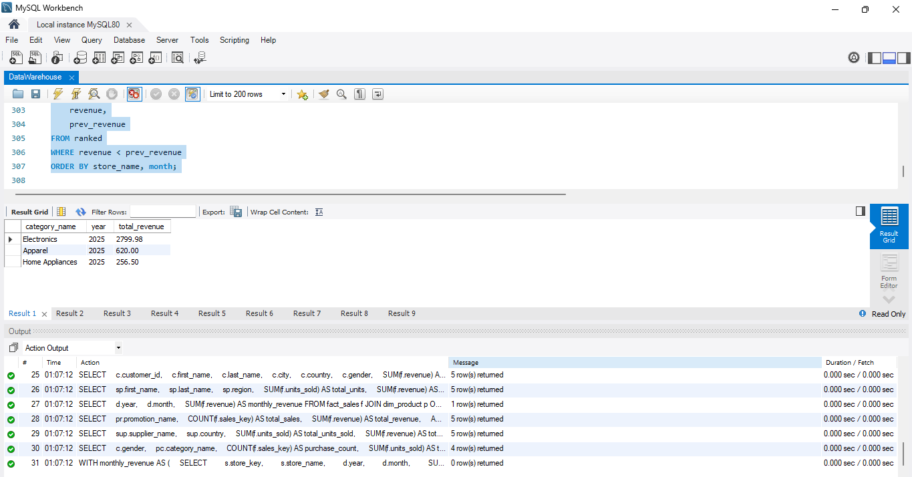

# Data Warehouse Project

This project demonstrates a **star schema** design for a retail data warehouse implemented in **MySQL**. 

## Features

* **Star schema** with 8 tables:

  * Dimensions: Customer, Product, Product Category, Store, Salesperson, Supplier, Date, Promotion
  * Fact: Sales fact table linking all dimensions with metrics
* Sample data inserts (5+ rows per table) representing realistic retail data
* Complex SQL queries showcasing joins, aggregations, window functions, and filtering
* Aggregated analytics by category, store, customer demographics, time, and more

## Technologies

* **MySQL** / **MariaDB** (compatible with MySQL Workbench)
* SQL for schema, data, and analytics queries

---

## Sample Query Output Screenshot
Sample Query 1 Output

Sample Query 2 Output

Sample Query 3 Output

